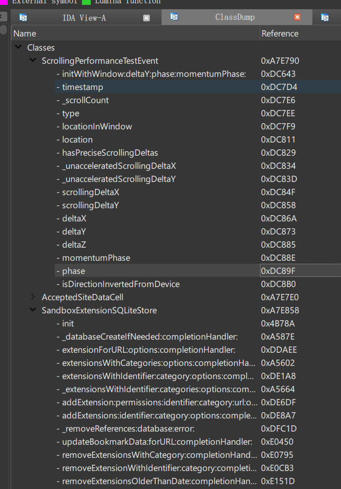

# ObjCExplorer for IDA Pro

<kbd>Ctrl + Shift + E</kbd> to open this panel

**Only tested on IDA 7.x. Python2 is NOT supported**

Double click the list to jump to methods

Thanks to [trailofbits/ObjCGraphView](https://github.com/trailofbits/ObjCGraphView)

TODO:

* Swift?
* Direct methods and new iOS runtime support (https://developer.apple.com/videos/play/wwdc2020/10163/)
* xref
